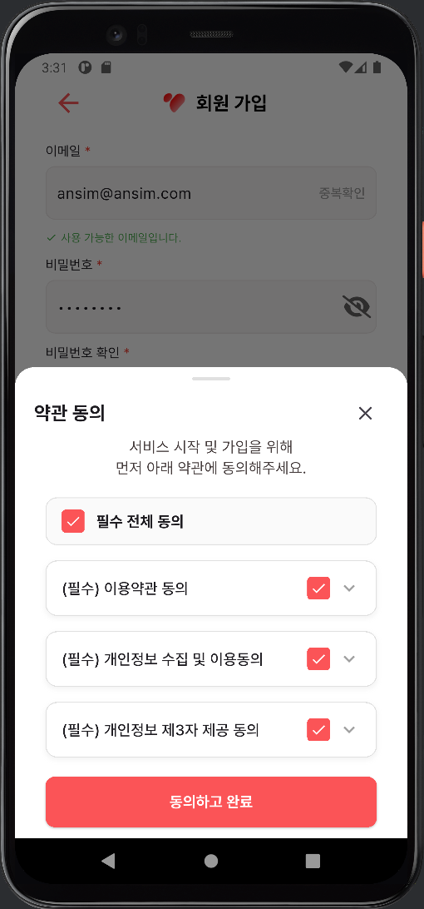
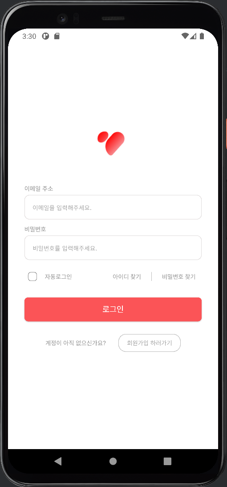
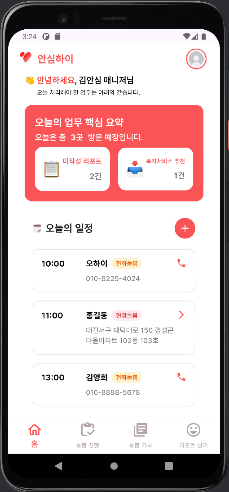
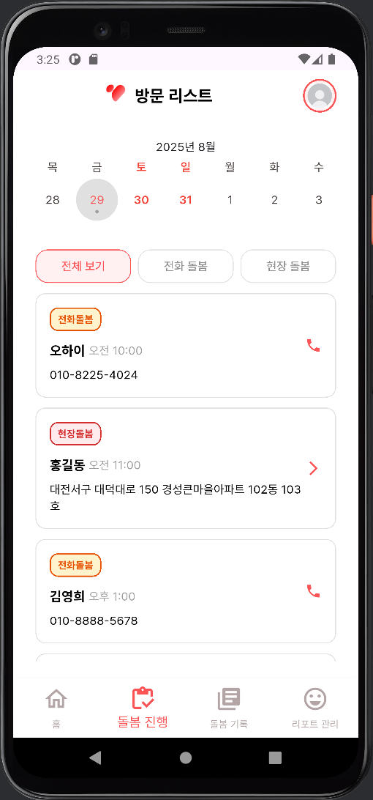
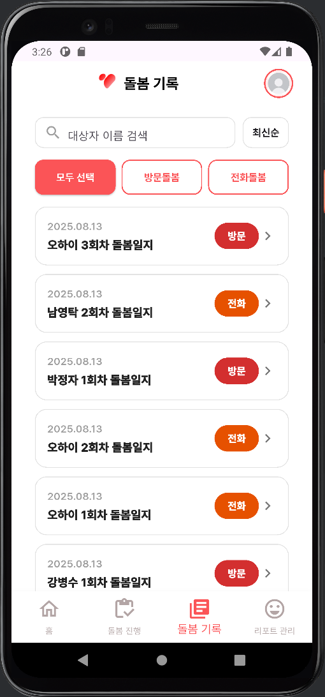
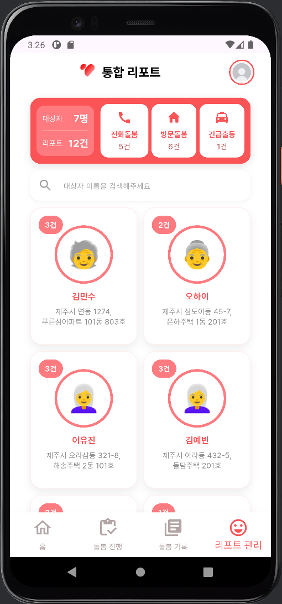
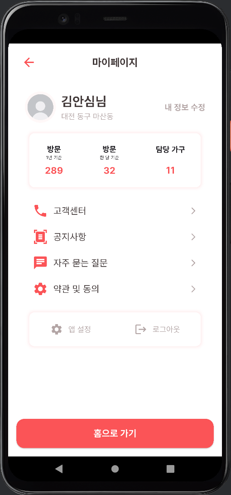

# AI-Care-Report-FE

AI 기반 상담 데이터 요약 및 리포트 자동화 시스템의 프론트엔드 리포지토리입니다. 본 프로젝트는 미래내일 일경험 사업의 일환으로 수행되었으며 한전 MCS의 전국 단위 돌봄 사업을 지원하기 위한 기술적 해결책을 개발하였습니다. 팀 단위 스타트업 프로젝트 형식을 통해 현장의 상담 데이터를 구조화하고 행정 업무를 자동화하는 시스템을 구축하였습니다.

---

## 실행 방법

```bash
# 의존성 패키지 설치
flutter pub get

# 프로젝트 실행
flutter run

```

## 프로젝트 개요

* 주제: AI 기반 상담 데이터 요약 및 리포트 자동화 시스템
* 수행 기간: 2025.07.16 ~ 2025.08.29
* 수행 기관: [솔트웨어(주)] 미래내일 일경험 인턴십
* 역할: 프론트엔드 아키텍처 설계 및 UI 개발
* 주요 기능:

  * 홈: 일정 확인 및 미작성 리포트 알림, 맞춤형 서비스 추천
  * 인증: JWT 기반 보안 로그인 및 회원가입, 세션 유지
  * 방문: 대상자 목록 관리 및 실시간 STT 기반 상담 녹음
  * 리포트: 5단계 입력 프로세스를 통한 리포트 자동 생성 및 미리보기
  * 마이페이지: 유저 정보 관리 및 설정

---

## 기술 스택
* Framework: Flutter 3.32 (Dart)
* Architecture: MVVM (Model-View-ViewModel) 패턴 적용
* State Management: Provider 활용
* Network: http 패키지 기반 RESTful API 연동
* Auth: JWT 기반 인증 및 자동 로그인 처리
* Design Pattern: Atomic Design 기반 위젯 모듈화

---

## 개인 기여
* Provider 기반 상태 관리 및 토큰 활용 자동 로그인 로직 구현
* JWT 기반 로그인 및 회원가입 API 연동 성공
* 홈, 리포트 작성(1~5단계), 방문 관리, 마이페이지 UI 전반 설계 및 구현
* AppBar, Button, Card 등 공통 컴포넌트 모듈화를 통한 코드 재사용성 향상


## 디렉토리 구조

```text
lib/
├── core/                     # API 주소 및 공통 상수 관리
├── model/                    # 데이터 모델 및 JSON 직렬화 로직
├── provider/                 # 비즈니스 로직 및 전역 상태 관리
├── repository/               # 외부 API 통신 계층
├── service/                  # STT 처리 및 리포트 가공 로직
├── util/                     # 토큰 저장 및 네트워크 유틸리티
├── view/                     # UI 레이어 구성
├── view_model/               # View와 Model 사이의 상태 중재
├── widget/                   # 프로젝트 공통 위젯 모듈
└── main.dart                 # 앱 진입점

```

---

## 주요 구현 사항

### 사용자 인증

* 회원가입 및 로그인 API 연동을 통한 JWT 인증 체계 구축
* login_storage_helper.dart 개발을 통한 보안 토큰 저장 및 세션 관리

### 홈 화면

* 오늘 일정 및 미작성 리포트 현황 시각화
* LED 센서 환경 데이터 기반 맞춤형 복지 서비스 추천 알림

### 방문 및 상담 기록

* 방문 대상자 목록 조회 및 상세 정보 확인
* 실시간 STT 기술을 활용한 상담 내용 녹음 및 텍스트 변환 인터페이스

### 리포트 자동화

* 상담 데이터를 구조화하여 5단계 입력 폼으로 변환하는 프로세스 구현
* 사전 정의된 템플릿 기반 리포트 미리보기 기능 개발

---

## UI 시연 이미지

실제 개발 화면

| 회원가입 | 로그인 | 홈 화면 | 방문 진행 | 기록 관리 | 리포트 관리 | 마이페이지 |
| :---: | :---: | :---: | :---: | :---: | :---: | :---: |
| [](lib/docs/images/signup.png) | [](lib/docs/images/login.png) | [](lib/docs/images/home.png) | [](lib/docs/images/visit.png) | [](lib/docs/images/record.png) | [](lib/docs/images/report.png) | [](lib/docs/images/mypage.png) |

---

## 시연 영상

[Demo Video](https://www.youtube.com/watch?v=rGAkDS2AEVM)